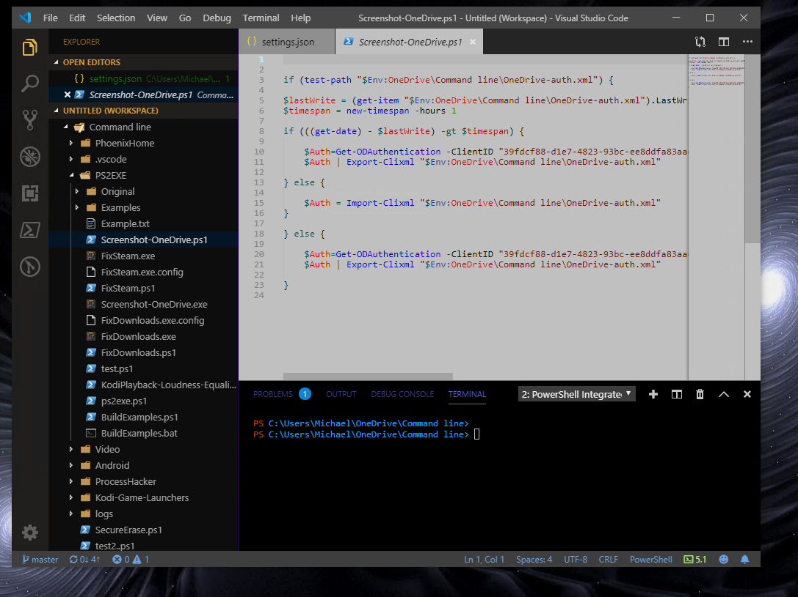

# MKANET color theme for Visual Studio Code

I decided to create my own gray color theme from scratch to avoid headaches I got from traditional dark and light-colored themes.  I spent a lot of time choosing precise colors for syntax coloring and the Sidebar colors and other UI components.

## The "ultimate" gray color theme

Theme created by: Michael K. Avanessian
